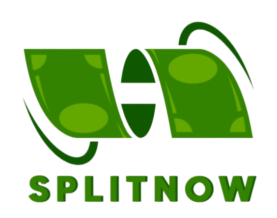

<div align="center">
  
  
  # 💸 SplitNow
  
  **The smart way to split expenses with friends and family**
  
  [](https://nextjs.org/)
  [](https://www.typescriptlang.org/)
  [](https://convex.dev/)
  [](https://tailwindcss.com/)
  
  [🚀 Live Demo](https://splitnow-app.vercel.app) • [📖 Documentation](#documentation) • [🐛 Report Bug](https://github.com/Prakharsahu10/SplitNow/issues) • [✨ Request Feature](https://github.com/Prakharsahu10/SplitNow/issues)
</div>

---

## ✨ Features

<div align="center">
  <table>
    <tr>
      <td align="center">
        
        <br><strong>Smart Expense Tracking</strong>
        <br>Track expenses with multiple split types
      </td>
      <td align="center">
        
        <br><strong>Group Management</strong>
        <br>Create groups for trips, roommates, etc.
      </td>
      <td align="center">
        
        <br><strong>Easy Settlements</strong>
        <br>Record payments and settle balances
      </td>
    </tr>
    <tr>
      <td align="center">
        
        <br><strong>AI-Powered Insights</strong>
        <br>Get spending analysis with Google AI
      </td>
      <td align="center">
        
        <br><strong>Payment Reminders</strong>
        <br>Automated email reminders via Inngest
      </td>
      <td align="center">
        
        <br><strong>Interactive Dashboard</strong>
        <br>Beautiful charts and visualizations
      </td>
    </tr>
  </table>
</div>

### 🎯 Core Functionality

- **💰 Expense Management**: Add expenses with flexible splitting options (equal, percentage, exact amounts)
- **👥 User & Group Management**: Invite friends, create groups, manage participants
- **🧮 Smart Calculations**: Automatic balance calculations and debt tracking
- **📊 Visual Analytics**: Charts and graphs powered by Recharts
- **🔔 Automated Reminders**: Daily payment reminders via Inngest workflows
- **🤖 AI Insights**: Spending analysis and recommendations using Google Gemini AI
- **📱 Responsive Design**: Works seamlessly on desktop and mobile devices
- **🔐 Secure Authentication**: Powered by Clerk with social login support

---

## 🛠️ Tech Stack

<div align="center">

### Frontend


### Backend & Database


### UI & Components


### Authentication & AI


</div>

---

## 🚀 Quick Start

### Prerequisites

- Node.js 18+ and npm
- A Convex account ([convex.dev](https://convex.dev))
- A Clerk account for authentication ([clerk.com](https://clerk.com))

### Installation

1. **Clone the repository**

   ```bash
   git clone https://github.com/Prakharsahu10/SplitNow.git
   cd SplitNow
   ```

2. **Install dependencies**

   ```bash
   npm install
   ```

3. **Set up environment variables**

   ```bash
   cp .env.example .env.local
   ```

   Fill in your environment variables:

   ```env
   NEXT_PUBLIC_CONVEX_URL=your_convex_url
   NEXT_PUBLIC_CLERK_PUBLISHABLE_KEY=your_clerk_publishable_key
   CLERK_SECRET_KEY=your_clerk_secret_key
   GEMINI_API_KEY=your_google_ai_api_key
   RESEND_API_KEY=your_resend_api_key
   ```

4. **Initialize Convex**

   ```bash
   npx convex dev
   ```

5. **Start the development server**

   ```bash
   npm run dev
   ```

6. **Start Inngest dev server** (in a separate terminal)
   ```bash
   npx inngest-cli@latest dev
   ```

Open [http://localhost:3000](http://localhost:3000) to see the app in action! 🎉

---

## 📱 Screenshots

<div align="center">
  
  <p><em>Beautiful dashboard with expense tracking and analytics</em></p>
</div>

---

## 🏗️ Project Structure

```
splitnow/
├── 📁 app/                    # Next.js App Router
│   ├── 📁 (auth)/            # Authentication pages
│   ├── 📁 (main)/            # Main application pages
│   └── 📁 api/               # API routes (Inngest)
├── 📁 components/            # Reusable UI components
│   └── 📁 ui/               # Shadcn/ui components
├── 📁 convex/               # Convex backend functions
├── 📁 lib/                  # Utility functions
│   └── 📁 inngest/          # Inngest workflows
├── 📁 hooks/                # Custom React hooks
└── 📁 public/               # Static assets
```

---

## 🤝 Contributing

We love contributions! Here's how you can help:

1. **Fork the repository**
2. **Create a feature branch** (`git checkout -b feature/amazing-feature`)
3. **Commit your changes** (`git commit -m 'Add amazing feature'`)
4. **Push to the branch** (`git push origin feature/amazing-feature`)
5. **Open a Pull Request**

### Development Guidelines

- Follow the existing code style and conventions
- Write meaningful commit messages
- Add tests for new features when possible
- Update documentation as needed

---

## 📋 Roadmap

- [ ] 🔄 Real-time expense syncing
- [ ] 📧 Enhanced email templates
- [ ] 🌍 Multi-currency support
- [ ] 📱 Progressive Web App (PWA)
- [ ] 🎨 Dark mode theme
- [ ] 📈 Advanced analytics
- [ ] 🔗 Payment gateway integration
- [ ] 📱 Mobile app (React Native)

---

## 📄 License

This project is licensed under the MIT License - see the [LICENSE](LICENSE) file for details.

---

## 🙏 Acknowledgments

- [Next.js](https://nextjs.org/) for the amazing React framework
- [Convex](https://convex.dev/) for the real-time backend
- [Clerk](https://clerk.com/) for authentication
- [Shadcn/ui](https://ui.shadcn.com/) for beautiful UI components
- [Inngest](https://inngest.com/) for workflow automation
- [Vercel](https://vercel.com/) for deployment and hosting

---

<div align="center">
  
  **Made with ❤️ by [Prakhar Sahu](https://github.com/Prakharsahu10)**
  
  ⭐ Star this repo if you found it helpful!
  
  [🌟 GitHub](https://github.com/Prakharsahu10/SplitNow) • [🐦 Twitter](https://twitter.com/your-handle) • [💼 LinkedIn](https://linkedin.com/in/your-profile)
  
</div>

---

<div align="center">
  <sub>Built with Next.js, TypeScript, and lots of ☕</sub>
</div>
